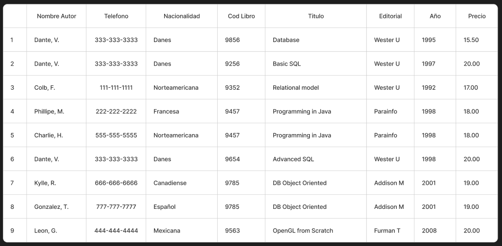
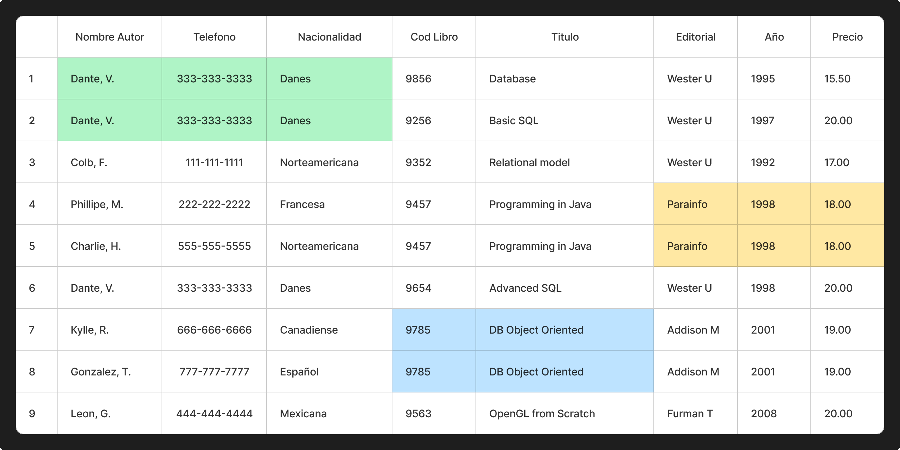
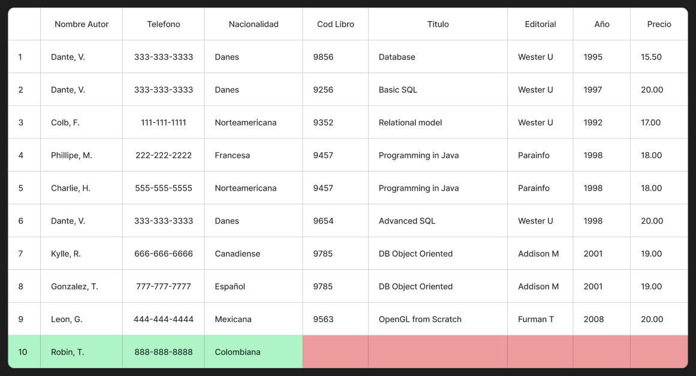
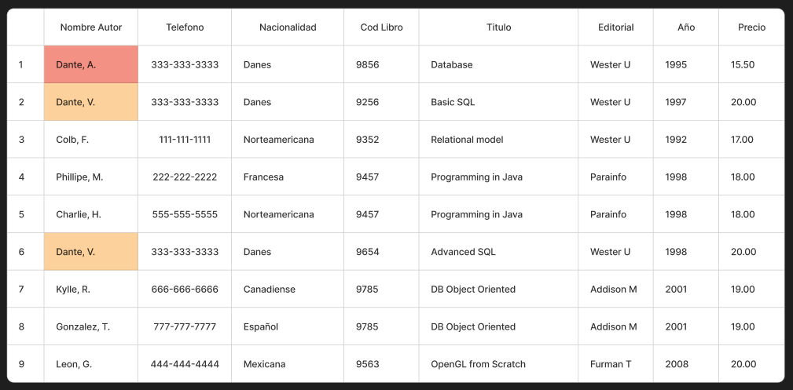
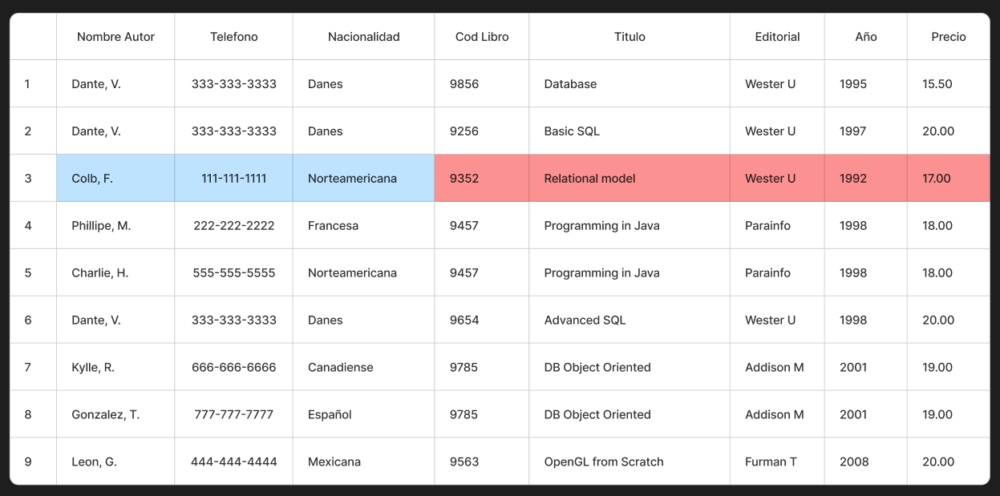

# Anomalías o Redundancia en una BD

Se denominan a los problemas que presentan las BBDD que no han sido diseñadas sin la **normalización**. Las anomalías que se presentan son las siguientes:

* **Inserción**: Imposibilidad de adicionar datos en la BD debido a la ausencia de otros datos, columnas que no aceptan nulos.
* **Modificación**: Ocurre cuando se deben actualizar los mismos datos en múltiples filas de una tabla, lo que puede provocar inconsistencias si se olvida actualizar todas las ocurrencias. Podría también darse el caso que una actualización afecta a otras tablas que no queremos.
* **Eliminación**: Ocurre cuando al eliminar una fila, también se eliminan inadvertidamente otras filas que deberían permanecer en al BD. También se puede dar que cuando se elimina una fila se pierde información relevante que estaba asociada con la fila eliminada.

Además, hay que tener cuidado con la **redundancia** (repetición de datos en un sistema) de los datos.

>[!NOTE]
Hechos distintos deben almacenarse en objetos distintos.

Tomando como ejemplo siguiente tabla, veamos los **tres** casos de las anomalías.

**Redundancia:**
Podemos ver que se repiten varios valores, por ejemplo  se repite para estos grupos de columnas 

|Nombre Autor|Teléfono| Nacionalidad|
|---|---|---|
|Dante, V.|333-333-3333|Danes|

|Cod Libro|Título|
|---|---|
|9785|DB Object Oriented|

|Editorial|Año|Precio|
|---|---|---|
|Parrainfo M|1998|18.00|

1. **Anomalía de Inserción:**
Podemos inferir que la **clave primaria** en este caso sería `Cod Libro` ya que no podría haber dos libros diferentes con un mismo código. El problema con esta tabla es que podemos agregar el dato de un nuevo autor que aún no ha publicado un libro por lo que no tendría `Cod Libro`.

1. **Anomalía de Modificación:**

Si cambiamos un dato tendremos que cambiarlo en todos los que se repite, en este ejemplo si cambiamos el un dato de la columna **Nombre Autor**, tendremos que actualizar en todas las filas en que se repita.

3. **Anomalía de Eliminación**
Si queremos eliminar los datos de un libro, o una fila, esto puede comprometer los otros datos, estaríamos eliminando los datos del Autor que podría ser el único dato sobre ese autor lo que indicaría como si no existiera ese autor. Como ejemplo, eliminamos el libro de la _**fila 3**_ estaríamos eliminando el único registro en que tenemos al autor **Colb, F.**.

>[!NOTE]
Todos estos problemas se presenta al tener toda nuestra base de datos en una sola tabla, esto se correge mediante las **Normalización**.