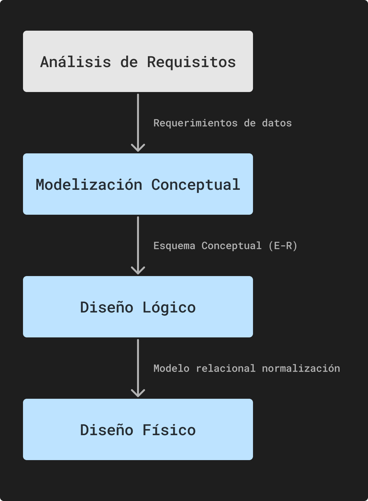

# Modelado de Datos

## ¿Qué es un modelo?

Es una estructura el cuál damos al diseño de la base de datos para tener un funcionamiento óptimo a su propósito. El modelado de datos puede involucar diagrama de entidad-relación, diagramas de clases, diagrama de flujo de datos, etc.

>[!NOTE]
Los datos presentan un dominio, al igual que en las matemáticas que significa el rango que puede tomar una variable, este indica el rango que puede tener un dato y así aplicar restricciones para que no suceda lo contrario.

## Pasos para diseñar una BD

A grandes rasgos se debe de realizar una serie de pasos antes de crear o diseñar una BD, estos pasos serían:

* Entender el negocio: Se debe de reunir con los usuarios finales o el dueño del negocio para que nos explique el funcionamiento de este.
* Realizar lista de requerimientos: Se enlista todo lo que el usuario final deseé que se tenga, a partir de esta lista se puede saber qué datos se necesita en el modelo de datos.
* Revisar al documentación técnica del proceso: Con esto se puede saber de forma más rápida el negocio y su proceso.

## Niveles básico de diseño

### Nivel conceptual

Se **define los datos específicos** que se tendrán en la base de datos, se **indica la relación que existe entre los componentes** (conjunto de datos crea un componente) y su **cardinalidad**. Los modelos en este nivel son útiles para la comunicación con los usuarios finales y los stakeholders del proyecto, ya que representan el entendimiento común del dominio del problema.

El objetivo es describir los datos, no el diseño de la estructura de la BD.

### Nivel lógico

Una vez definida todos los componentes, se procede a **estructurar** cada componente principal **como una tabla** que está relacionada con otras tablas del modelo de datos.

Un modelo lógico es un lenguaje usado para especificar esquemas lógicos (modelo relacional, modelo de red, modelo jerarquico, etc.). El diseño lógico depende del tipo de **DBMS** que se vaya a utilizar, no depende del producto concreto.

### Nivel físico

Es una descripción dela implementación de una BD: las estructuras de almacenamiento y los métodos utilizados para tener un acceso eficiente a los datos. Depende del **DBMS** para expresarse mediante un lenguaje de defición de datos.

