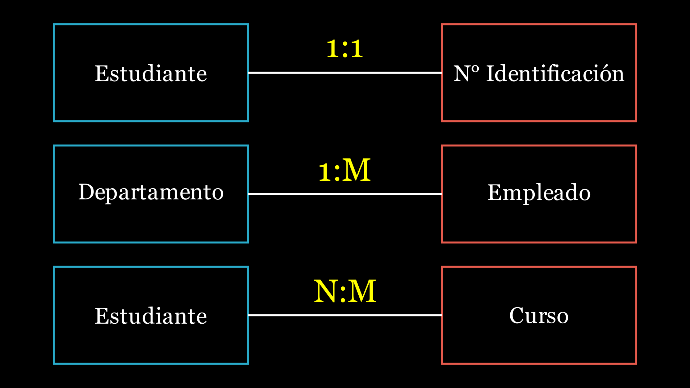
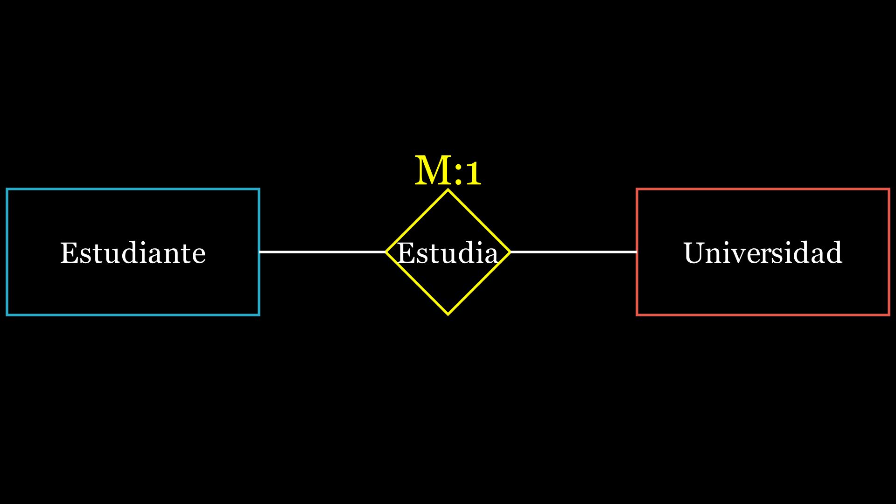

# Modelo Entidad-Relación

Es la representación del modelo conceptual, en el cual, mediante diagrama, se muestra la **relación** (cardinalidad) de las **entidades** y sus respectivos **atributos**.

## Entidades

Representa un objeto que puede ser tangible o intangible, estas entidades representan la característica importante para el sistema. Ejemplo: colegio, hospital, banco, videojuego, entre otros.

Representación gráfica para las entidades

## Atributos

Los atributos son los que caracteriza a cada entidad, estas se representarán en todas las instancias u objetos de cada entidad. Cabe recalcar que cada objeto se diferencia mediante sus atributos. Además, cada atributo tiene un dominio en cual indica los valores posibles que puede adoptar, para atributos que tienen múltiples valores, se denomina `atributo multivaluado`

## Cardinalidad

La cardinalidad es la relación que existe entre dos entidades, describe la cuántas instancias de un entidad están relacionadas con cuántas instancias de otra entidad.

Hay tres tipos de principal de cardinalidad en las relaciones entre entidades:

* **Uno a Uno (1:1):** Una instancia de una entidad está asociada exactamente a una instancia de otra entidad, y viceversa. Ejemplo, un **estudiante** solo puede tener un **número de identificación** único, y este número de identificación único está asociado con solo ese estudiante.

* **Uno a Muchos (1:M):** Una instancia de una entidad está asociada con uno o más instancias de otra entidad, pero una instancia de la segunda entidad está solo asociada con exáctamente una instancia de la primera entidad. Ejemplo, un **departamento** puede tener muchos **empleados**, pero cada empleado solo puede pertenecer a un departamento.

* **Muchos a Muchos (N:M):** Una instancia de una entidad puede estar asociado a cero o más instancias de otra entidad, y viceversa. Ejemplo, un **estudiante** puede estar inscrito en varios **cursos**, y cada curso puede tener varios estudiantes inscritos.

## Relación

Representa la relación que existe entre dos entidades. Su representación gráfica es mediante un rombo y en su interior debe indicar el verbo de la relación que existe entre ambas entidades. Ejemplo, una entidad estudiante y otra entidad Universidad, donde cada instancia de la primera entidad solo puede estar asociada a un instancia de la otra entidad, además en la segunda instancia puede haber muchos estudiantes.

